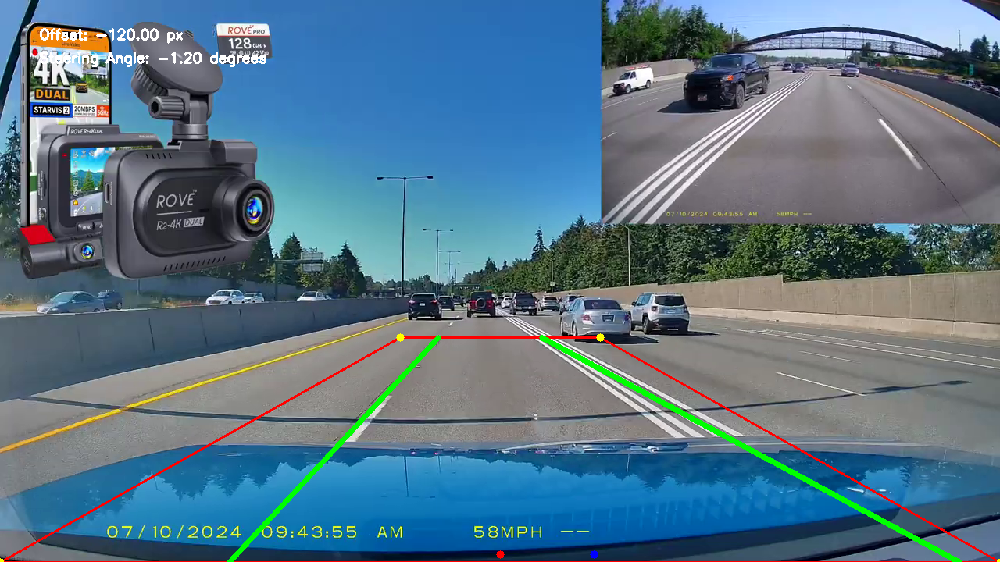

# README for Lane Detection Project

This project demonstrates a Python-based lane detection system using RANSAC for line fitting, combined with OpenCV for video processing and visualization. 

## Features
- **Lane Detection**: Identifies and tracks lane boundaries in a video.
- **Dynamic Region of Interest (ROI)**: Allows user adjustments to the trapezoidal ROI through a mouse interface.
- **Lane Smoothing**: Employs a history-based smoothing algorithm for consistent lane detection.
- **CSV Output**: Saves lane formulas (slopes and intercepts) for each frame to a CSV file.
- **Visualization**: Highlights detected lanes, car position, and provides steering offset in real-time.

## Example Output
Below is a sample output image of the lane detection system in action:



## Usage
1. **Install Dependencies**:
   Ensure you have the following Python libraries installed:
   ```bash
   pip install opencv-python-headless numpy scikit-image
   ```
2. **Run the Script**:
   Place your video file (e.g., `dashcam_video.mp4`) in the project directory. Run the script:
   ```bash
   python lanedetectionvideo.py
   ```
3. **Interact with ROI**:
   Adjust the trapezoid by dragging its corners in the preview window.

4. **Output**:
   - Detected lane frames are saved in the `output_frames` folder.
   - A CSV file (`lane_formulas.csv`) contains lane line equations for each frame.

## Controls
- Press `Q` to quit the video processing preview.

Enjoy accurate and efficient lane detection!
